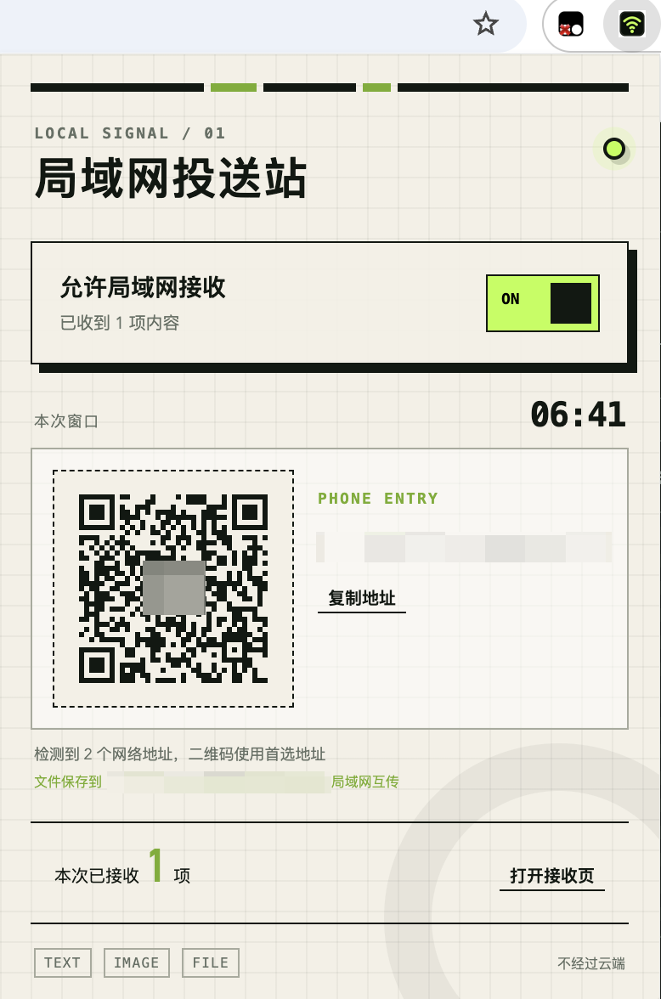
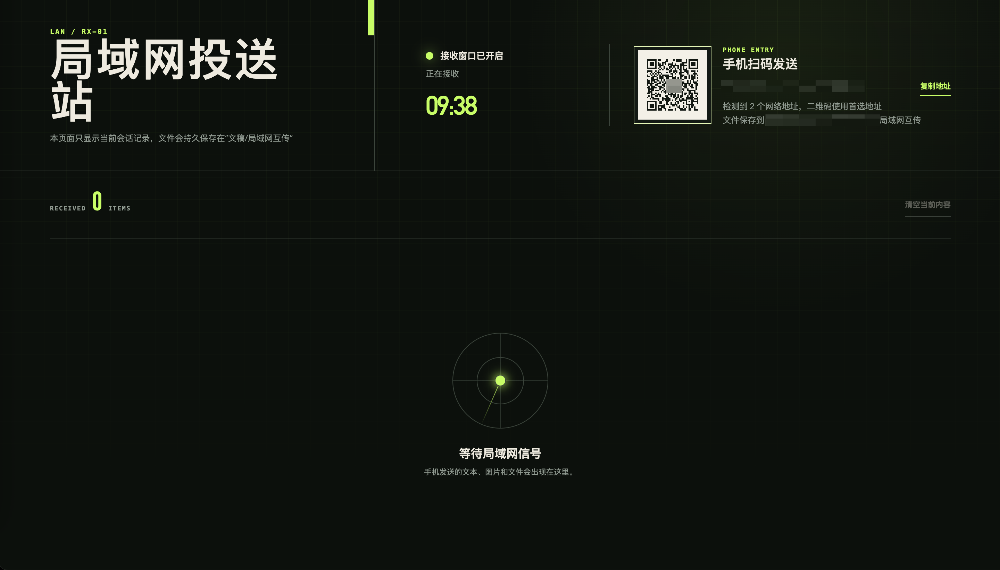

# 局域网投送站

一个面向 macOS 与 Chrome 的局域网文件接收工具。打开扩展后，用手机扫描二维码即可在同一局域网内向电脑发送文本、图片和文件；文件直接保存到本机，不经过云端服务器。


## 功能

- 手机扫码后通过浏览器访问本机临时接收页，发送文本、图片或文件。
- 仅在开启接收窗口时启动本地服务，默认接收时长为 10 分钟。
- 每次会话生成随机访问令牌；接收页只对同一局域网内持有二维码链接的设备开放。
- 接收文件默认保存到 `~/Documents/局域网互传/`，同名文件自动编号，不覆盖已有文件。
- 支持查看本次会话的接收记录、在访达中显示文件、移除记录和清空会话记录。
- 不创建登录项、常驻服务、定时任务或云端账号。

## 截图

| 扩展弹窗 | 电脑接收页 |
| --- | --- |
|  |  |

## 环境要求

- macOS
- Google Chrome
- Node.js 18 或更高版本

## 安装

1. 下载或克隆本仓库。
2. 在终端进入项目根目录，执行安装脚本：

   ```bash
   ./installer/install.sh
   ```

   脚本会安装按需启动的 Native Messaging Host，并在 Chrome 中注册它。使用 `--yes` 可跳过交互确认。

3. 在 Chrome 地址栏打开 `chrome://extensions`，开启右上角“开发者模式”。
4. 点击“加载已解压的扩展程序”，选择项目中的 `extension/` 目录。
5. 将“局域网投送站”固定到 Chrome 工具栏，方便随时开启接收。

## 使用说明

1. 点击工具栏中的扩展图标，打开“允许局域网接收”开关。
2. 在扩展弹窗或电脑接收页获取二维码。
3. 确认手机和 Mac 连接到同一局域网，用手机扫描二维码。
4. 在手机页面发送文本、图片或文件。
5. 电脑端会实时显示接收记录；文件保存至 `~/Documents/局域网互传/`。
6. 使用完毕后关闭接收开关，或等待倒计时结束。

## 安全与数据说明

- 服务只在接收窗口开启时运行，监听随机临时端口。
- 手机访问链接包含每次会话随机生成的令牌；令牌不会写入源码或配置文件。
- 接收的完整文件只保存在本机；文本仅保留在当前浏览器会话中。
- 上传过程中会生成隐藏临时分片，完成后原子写入目标文件；未完成分片会在会话结束或卸载时清理。

## 常用命令

```bash
# 运行测试
npm test

# 只读检查已安装组件、接收目录和运行进程
./installer/audit.sh

# 卸载 Native Host 与 Chrome 注册文件（默认保留已接收文件）
./installer/uninstall.sh

# 同时删除已接收文件
./installer/uninstall.sh --purge-downloads
```

## 项目结构

```text
.
├── extension/       # Chrome Manifest V3 扩展
├── native-host/     # Node.js Native Messaging Host 与手机发送页
├── installer/       # 安装、卸载与审计脚本
├── tests/           # 自动化测试
└── assets/          # README 配图
```

## 许可

当前仓库尚未声明开源许可证；在复用或分发前请先与作者确认。
